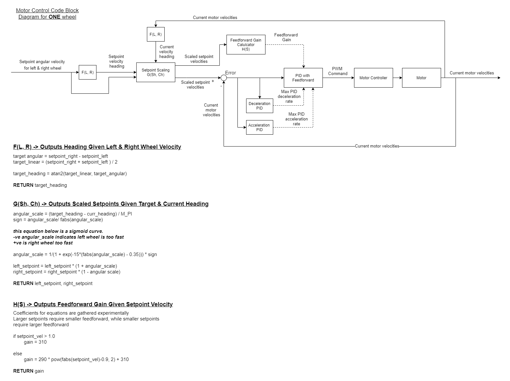

# scat_microcontroller

This repo contains code that is being run on the STM32 on the wheelchair. The microcontroller is in charge of velocity PID control of each motor with feedforward.
It also receives velocity commands from ROS, and sending IMU & velocity & joystick data to ROS.

The backbone of this project's code (most functions that begin with MX_ and Init functions) were generated by STMCubeMX, then additional user code is written in sections
that were designated for user code, between the comment indicators 'USER CODE BEGIN' & 'USER CODE END' at multiple locations. Additional user code was also added in 
separate header and source files.

Feel free to use STMCubeMX's code generation to create new initialization code for new ports, it will not delete user added source and header files, nor will it delete any code
that was added in the user code sections of main.c. Take note that if you disable a certain port, (eg SPI 1,3,6) because they have additional user code in the init functions for 
SPI 1,3,6, they will get removed.

## Sensor Block Diagram

## Motor Control Block Diagram

## Hardware and Peripheral Used
| Hardware | Peripheral Used | Pinout |
| --- | ----------- |  ------- |
| Joystick | ADC1 | PA0, PA1 |
| IMU-MPU6000 | SPI4 | PA8(CS), PE2(SCK), PE5(MISO), PE6(MOSI) |
| Base motor (Sabertooth) | TIM4 (Right)CH1  (Left)CH3 (Brake)CH4*| PD12(CH1), PD14(CH3), PD15(CH4) | 
| Driving Encoder | SPI1* | PA5(SCK), PA7(MOSI) |

**Note*:
  - Brake channel is currently not connected
  - Encoder data is sending from other MCU to this MCU via SPI
